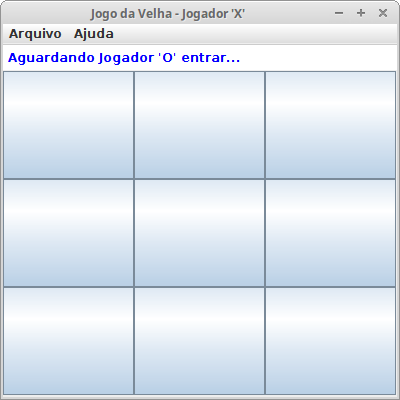
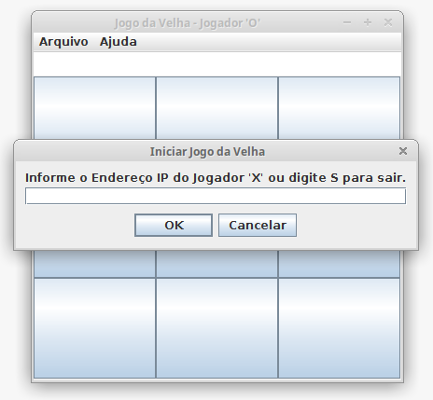
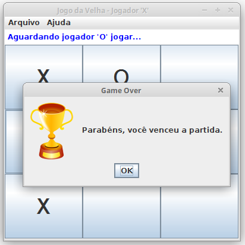
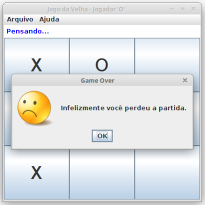
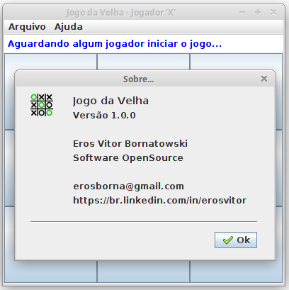

# CTSTicTacToe

## Descrição
Projeto exemplo que mostra como utilizar conceitos de programação paralela e comunicação cliente/servidor para criar um jogo que possa ser usado em ambiente de rede.

## Tecnologias
O projeto utiliza as seguintes tecnologias:

* Java 11
* Java Swing
* IDE Eclipse

## Screenshots

 

 

## Histórico de lançamentos

* 1.0.0 (2021-05-01)
    * Primeira versão
